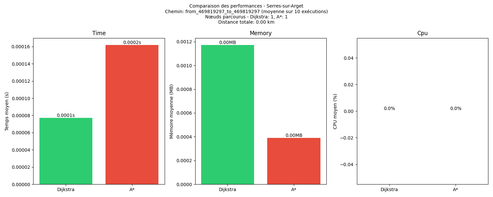
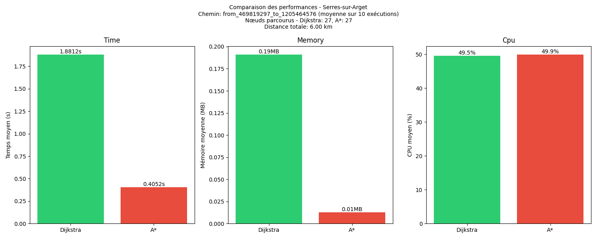
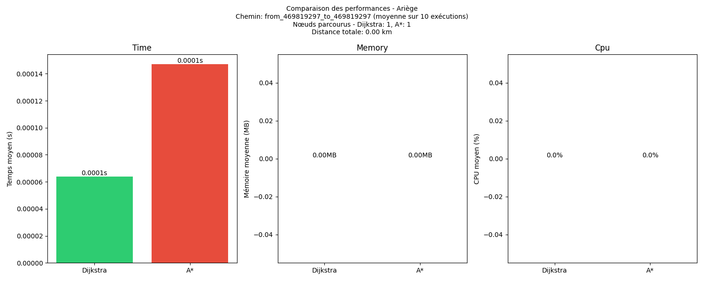
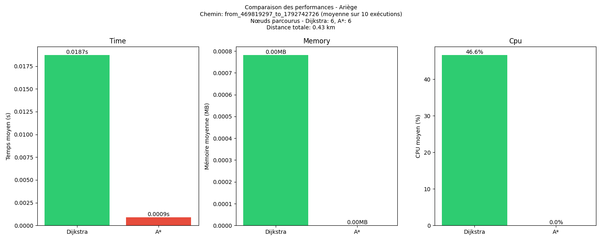
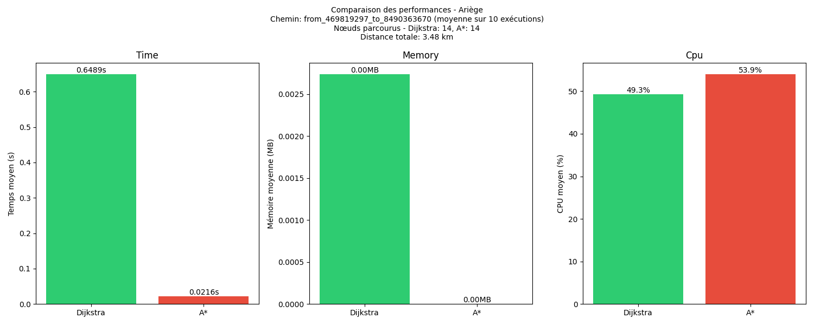

# Compte Rendu - Analyse et Optimisation de code - Projet Carte

| Version | Date | Auteur | Module |
|---------|------|--------|--------|
| 1.0 | 29 janvier 2025 | Kylian GACHET 2B | R5.A.04 - Qualité algorithmique |

## Sommaire
- [Compte Rendu - Analyse et Optimisation de code - Projet Carte](#compte-rendu---analyse-et-optimisation-de-code---projet-carte)
  - [Sommaire](#sommaire)
  - [1. Description du projet](#1-description-du-projet)
  - [2. Installation](#2-installation)
  - [3. Utilisation](#3-utilisation)
    - [3.1 Lancer la recherche de chemin](#31-lancer-la-recherche-de-chemin)
    - [3.2 Lancer les benchmarks de recherche de chemin](#32-lancer-les-benchmarks-de-recherche-de-chemin)
    - [3.3 Lancer les benchmarks de chargement des fichiers CSV](#33-lancer-les-benchmarks-de-chargement-des-fichiers-csv)
  - [4. Algorithme de Dijkstra (1956)](#4-algorithme-de-dijkstra-1956)
    - [4.1 Présentation de l'algorithme](#41-présentation-de-lalgorithme)
    - [4.2 Implémentation](#42-implémentation)
    - [4.3 Problèmes identifiés](#43-problèmes-identifiés)
    - [4.4 Solutions proposées](#44-solutions-proposées)
  - [5. Algorithme A\* (1968)](#5-algorithme-a-1968)
    - [5.1 Présentation de l'algorithme](#51-présentation-de-lalgorithme)
    - [5.2 Implémentation](#52-implémentation)
    - [5.3 Problèmes identifiés](#53-problèmes-identifiés)
    - [5.4 Solutions proposées](#54-solutions-proposées)
  - [6. Benchmark et Analyse](#6-benchmark-et-analyse)
    - [6.1 Environnement de test](#61-environnement-de-test)
    - [6.2 Resultat comparatif](#62-resultat-comparatif)
      - [6.2.1 Temps de chargement des fichiers CSV](#621-temps-de-chargement-des-fichiers-csv)
      - [6.2.2 Jeux de données : Serres sur Arget](#622-jeux-de-données--serres-sur-arget)
      - [6.2.3 Jeux de données : Ariège](#623-jeux-de-données--ariège)
    - [6.3 Analyse et Comparaison de la complexité](#63-analyse-et-comparaison-de-la-complexité)
      - [6.3.1 Structure de données](#631-structure-de-données)
      - [6.3.2 Complexité algorithmique](#632-complexité-algorithmique)
      - [6.3.3 Complexité spatiale](#633-complexité-spatiale)
      - [6.3.4 Complexité temporelle](#634-complexité-temporelle)
      - [6.3.5 Complexité cyclomatique](#635-complexité-cyclomatique)
  - [7. Perspectives d'amélioration](#7-perspectives-damélioration)
  - [8. Conclusion](#8-conclusion)

## 1. Description du projet

Le projet consiste à développer et optimiser des algorithmes de recherche de chemin sur des données OpenStreetMap. L'objectif est d'implémenter et de comparer différents algorithmes de recherche de chemin pour trouver la distance puis le chemin optimal entre deux points.

Pour réaliser ce projet, nous allons comparer deux algorithmes de recherche de chemin :
- [Dijkstra (1956)](#4-algorithme-de-dijkstra-1956)
- [A* (1968)](#5-algorithme-a-1968)

Nous allons utiliser des données OpenStreetMap, qui sont des fichiers CSV contenant :
- Les **noeuds** ("nodes" ou "points") composés de :
  - id : l'identifiant du noeud
  - name : le nom du noeud
  - lat : la latitude du noeud
  - lon : la longitude du noeud
  - highway : le type de route du noeud
- Les **chemins** ("ways") composés de :
  - name : le nom du chemin
  - ref : l'identifiant du chemin
  - node_from : l'identifiant du noeud de départ
  - node_to : l'identifiant du noeud d'arrivée
  - highway : le type de route du chemin
  - destination : la destination du chemin
  - distance_km : la distance du chemin en km

> _Note : Les données contiennent toujours des anomalies, telles que des points isolés non connectés à un chemin, des chemins sans liaison à un point, ou encore des points présent plusieurs fois dans le fichier._

## 2. Installation

Afin de pouvoir lancer ce projet, tout d'abord il faut cloner le repository github.

```bash
git clone https://github.com/Iamkylian/Projet-Carte.git
```

Ensuite, il faut installer les dépendances nécessaires.

```bash
pip install -r requirements.txt
```

## 3. Utilisation

Pour lancer le projet, il faut se rendre dans le dossier du projet et lancer le fichier main.py.

```bash
cd Projet-Carte/src
python main.py
```

Les algorithme de Dijkstra et A* utilisent les points, coordonnées définit dans le fichier [```graph_data.py```](./projet-carte/src/graph_data.py).

### 3.1 Lancer la recherche de chemin

Pour lancer la recherche de chemin, utilisant les algorithmes de Dijkstra et A*, il faut éxecuter la commande suivante :

```bash
python path_display.py
```

### 3.2 Lancer les benchmarks de recherche de chemin

Pour lancer les benchmarks de recherche de chemin, il faut éxecuter la commande suivante :

```bash
python benchmark_paths.py
```

### 3.3 Lancer les benchmarks de chargement des fichiers CSV

Pour lancer les benchmarks de chargement des fichiers CSV, il faut éxecuter la commande suivante :

```bash
python load_csv_methods.py
```

## 4. Algorithme de Dijkstra (1956)

### 4.1 Présentation de l'algorithme
Développé par Edsger Dijkstra, cet algorithme trouve le plus court chemin entre deux points dans un graphe pondéré. 

**Principes clés :**
- Exploration progressive des nœuds à partir du point de départ
- Maintient une liste des distances minimales connues
- Visite systématiquement le nœud non visité le plus proche
- Garantit de trouver le chemin optimal

**Applications :**
- Routage réseau
- Navigation GPS
- Planification d'itinéraires

### 4.2 Implémentation

Vous pouvez trouvez l'implémentation de l'algorithme de Dijkstra dans le fichier [```graph.py```](./projet-carte/src/graph.py).

### 4.3 Problèmes identifiés
- Exploration excessive de nœuds non pertinents
- Recherche linéaire dans les edges pour trouver les voisins
- Stockage redondant des arêtes bidirectionnelles

### 4.4 Solutions proposées
- Restructurer le graphe pour un accès O(1) aux voisins (voir section [6.3.1 Structure de données](#631-structure-de-données))
- Orienter la recherche vers la destination pour éviter l'exploration inutile de nœuds
- Utiliser une estimation de la distance restante pour prioriser les nœuds prometteurs
- Réduction du graphe aux nœuds essentiels

> _Note : Les deux solutions concernant l'orientation de la recherche et l'estimation de la distance sont précisément ce que propose l'algorithme A*, qui sera présenté dans la section suivante. Par extension cela permet de reduire la recherche au noeud essentiel, et donc de reduire la complexité de l'algorithme. C'est pourquoi comme prochaine approche, il serait intéressant d'implémenter l'algorithme A*._

## 5. Algorithme A* (1968)

### 5.1 Présentation de l'algorithme
Développé par Peter Hart, Nils Nilsson et Bertram Raphael, A* est une extension de l'algorithme de Dijkstra qui utilise une heuristique pour accélérer la recherche.

**Principes clés :**
- Combine le coût réel (comme Dijkstra) avec une estimation heuristique


> _Qu'est ce qu'une heuristique ?_
> 
>> Une heuristique est une estimation de la distance restante pour atteindre la destination. Elle est utilisée pour accélérer la recherche.
>> Dans le contexte de A*, l'heuristique (comme la distance à vol d'oiseau) permet d'orienter la recherche vers la destination en estimant la distance restante, même si cette estimation n'est pas exacte, elle doit être optimiste (ne jamais surestimer la distance réelle).

- Utilise une fonction **f(n) = g(n) + h(n)**
  - **g(n)** : coût réel depuis le départ
  - **h(n)** : estimation heuristique jusqu'à l'arrivée
- Guide la recherche vers la destination

**Différences clés avec Dijkstra :**
1. **Direction de recherche :**
   - Dijkstra explore uniformément dans toutes les directions
   - A* oriente sa recherche vers la destination grâce à l'heuristique
2. **Efficacité :**
   - A* explore moins de nœuds grâce à l'heuristique
   - Plus rapide quand l'heuristique est bien choisie
3. **Optimalité :**
   - Les deux garantissent le chemin optimal
   - A* nécessite une heuristique admissible (qui ne surestime jamais)

### 5.2 Implémentation

Vous pouvez trouvez l'implémentation de l'algorithme de A* dans le fichier [```graph.py```](./projet-carte/src/graph.py).

### 5.3 Problèmes identifiés
- Heuristique potentiellement sous-optimale
- Pas d'optimisation pour les grands graphes
- Absence de pré-traitement des données

### 5.4 Solutions proposées
- Amélioration de l'heuristique
- Implémentation de la recherche bidirectionnelle
- Pré-calcul des chemins fréquents
- Mise en cache des résultats

Ces solutions ne seront pas implémentées dans le cadre de ce projet, mais elles sont tout de même intéressantes à mentionner dans le cas d'une continuation de ce projet et donc optimisation de l'algorithme A*.

## 6. Benchmark et Analyse

Les benchmarks ont été réalisés sur différents jeux de données :
1. **Serres sur Arget** : dans ```data/france/serres-sur-arget/```
2. **Ariège** : dans ```data/france/ariege/```

Voir ```graph_data.py``` pour plus de détails sur la structure des dossiers et fichiers de données.

Différents types de métriques seront mesurés :
- **Temps d'exécution** : temps de recherche de chemin
- **Utilisation de la mémoire**
- **Utilisation du CPU (en %)**
- **Nombre de nœuds visités**
- **La distance parcourue**
- **Le nombre d'éxecutions** : utilisé afin d'obtenir la moyenne des résultats des métriques pour des résultats plus pertinents.

### 6.1 Environnement de test

Voici la configuration de l'environnement utilisé pour réaliser les tests :
- Test effectué sur un pc portable **MSI GL76 - 40GB RAM - 11th Gen Intel(R) Core(TM) i5-11400H**
- Version de Python : 3.13.1

### 6.2 Resultat comparatif

#### 6.2.1 Temps de chargement des fichiers CSV

Pour réaliser les benchmarks, le temps de chargement des fichiers CSV a été un facteur important. La méthode utilisée initialement était le module python ```csv python```, cependant il a été remarqué que les performances étaient médiocres. En recherchant des alternatives, les modules ```pandas``` et ```polars``` ont été testés.

Test du chargement des fichiers CSV effectué sur le jeux de données **Serres sur Arget** :


Test du chargement des fichiers CSV effectué sur le jeux de données **Ariège** :


On remarque que les performances des modules ```pandas``` et ```polars``` sont bien meilleures que le module ```csv python```. La différence entre la méthode ```csv python``` et, ```pandas``` et ```polars``` est trés grande et non négligable. On peut également constater que plus la taille du jeu de données augmente, plus l'écart de performance entre Pandas et Polars tend à se réduire. Cela peut se confirmer en regardant les 2 graphiques ci-dessus :

- Entre ```pandas``` et ```polars``` pour le jeux de données **Serres sur Arget** : différence relative de 29 (soit 29% de différence)
- Entre ```pandas``` et ```polars``` pour le jeux de données **Ariège** : différence relative de 15 (soit 15% de différence)

La différence de temps de chargement entre ```pandas``` et ```polars``` est divisée par 2 entre les deux jeux de données.

> _Note : La différence entre les performances de ```pandas``` et ```polars``` est très faible, cependant il semble que ```polars``` soit légèrement plus performant que ```pandas```._

Afin de pouvoir réaliser ces tests, le fichier [```load_csv_methods.py```](./projet-carte/src/load_csv_methods.py) a été utilisé.

Pour la suite du projet, il a été choisi d'utiliser **Polars** qui démontre les meilleures performances pour la lecture des fichiers CSV dans notre cas d'utilisation.


#### 6.2.2 Jeux de données : Serres sur Arget

Ensuite des benchmarks ont été réalisés pour les algorithmes de Dijkstra et A* afin de mesurer les métriques mentionner précédemment dans la partie [6. Benchmark et Analyse](#6-benchmark-et-analyse). Vous pouvez regénérer tous les graphiques des jeux de données, comme indiqué dans la partie [3.2 Lancer les benchmarks de recherche de chemin](#32-lancer-les-benchmarks-de-recherche-de-chemin), en éxecutant la commande :

```bash
python benchmark_paths.py
```

Résultat des benchmarks, pour le chemin du node **Saint-Pierre-de-Rivière (469819297)** au node **Saint-Pierre-de-Rivière (469819297)**.



Résultat des benchmarks, pour le chemin du node **Saint-Pierre-de-Rivière (469819297)** au node **Las Prados (1792742726)**.


Résultat des benchmarks, pour le chemin du node **Saint-Pierre-de-Rivière (469819297)** au node **Grotte Bernard (8490363670)**.


Résultat des benchmarks, pour le chemin du node **Saint-Pierre-de-Rivière (469819297)** au node **Cabane Coumauzil - barguillere (1205464576)**.


> _Note : Ce benchmark du chemin de Saint-Pierre-de-Rivière à Cabane Coumauzil - barguillere est le plus long des 4 chemins tester. Cependant en raison de probléme de données dans le jeu de données Ariège, il n'a pas été possible de réaliser ce benchmark pour le chemin de Saint-Pierre-de-Rivière à Grotte Bernard dans la partie suivante : [6.2.3 Jeux de données : Ariège](#623-jeux-de-données--ariège)._

On peut constater que les performances de l'algorithme **A*** sont **nettement supérieures** à celles de l'algorithme de **Dijkstra** dans la plupart des cas. Cependant, il est intéressant de noter que l'algorithme de **Dijkstra** se montre plus **performant** pour le **chemin le plus court** : ```469819297 (Saint-Pierre-de-Rivière) -> 469819297 (Saint-Pierre-de-Rivière)```. 
Bien que la cause exacte de ce comportement n'ait pas pu être approfondie par manque de temps, cela pourrait s'expliquer par le **surcoût initial** de calcul de l'**heuristique** dans **A***. Pour les chemins plus longs, l'algorithme **A*** démontre une **meilleure efficacité** en termes d'**utilisation de la mémoire**, mais nécessite en contrepartie plus de ressources **CPU** pour le calcul de l'**heuristique**. On peut remarquer que le pourcentage du **CPU** utilisé par l'algorithme **A*** diminue lorsque le chemin devient plus long.
L'algorithme **A*** est donc plus **performant** pour les **chemins plus longs**, on peut le constater dans le benchmark pour le chemin de Saint-Pierre-de-Rivière à Cabane Coumauzil - barguillere.

#### 6.2.3 Jeux de données : Ariège

Résultat des benchmarks, pour le chemin du node **Saint-Pierre-de-Rivière (469819297)** au node **Saint-Pierre-de-Rivière (469819297)**.


Résultat des benchmarks, pour le chemin du node **Saint-Pierre-de-Rivière (469819297)** au node **Las Prados (1792742726)**.


Résultat des benchmarks, pour le chemin du node **Saint-Pierre-de-Rivière (469819297)** au node **Grotte Bernard (8490363670)**.


Même observation concernant les performances de l'algorithme **A*** par rapport à l'algorithme de **Dijkstra** en termes de **temps de recherche**. L'algorithme **A*** est **plus performant** pour les chemins plus longs contrairement a **Dijkstra**. 
Etonnament l'algorithme **A*** ne consomme pas de **mémoire** ou alors trés peu, rendant impossible de mesurer la mémoire utilisée par l'algorithme. Il consomme également le plus de **CPU** pour les chemins les plus longs avec très peu de différence entre les deux algorithmes. Cette différence de **performance** s'explique par l'utilisation de l'**heuristique** qui permet à **A*** de mieux cibler la recherche du chemin optimal.

Certaines **"erreurs"** observées ou **graphiques incohérents** dans les **benchmarks** pourraient être évitées en executant les benchmarks avec un **nombre d'exécutions** plus important, afin de pouvoir obtenir des résultats plus **fiables** pour la comparaison des algorithmes.

### 6.3 Analyse et Comparaison de la complexité

#### 6.3.1 Structure de données

Deux approches ont été envisagées pour la structure de données du graphe, dans laquelle les données sont stockées :

1. **Structure initiale (Basique) :**

```python
class Node:
    def __init__(self):
        self.nodes = {}
```

Cette premiére structure de données est la plus simple, la plus intuitive et donc à été utilisée pour la première version du projet. Cependant elle n'est pas optimisée pour les grands graphes.

**Avantages :**
- Structure simple et intuitive
- Facilité d'implémentation

**Inconvénients :**
- Recherche des voisins en O(E) où E est le nombre d'arêtes
- **Redondance** des données pour les arêtes bidirectionnelles
- **Consommation mémoire** plus importante
- Performance **dégradée** pour les grands graphes

Cette structure de données est donc à éviter pour les grands graphes. C'est pourquoi une seconde structure de données, plus optimisée, a été implémentée.

1. **Structure actuelle (Optimisée) :**

```python
class Node:
    def __init__(self, id, lat, lon, name):
        self.id = id
        self.lat = lon
        self.lon = lat
        self.name = name
        self.neighbors = {}  # {node_id: distance}

class Graph:
    """Class representing a graph for path calculations.
    
    This class allows building and manipulating a graph from OSM data
    to calculate distances and shortest paths.
    
    Attributes:
        nodes (dict): Dictionary of nodes with their coordinates {id: Node}
    """
    
    def __init__(self):
        """Initialize a new empty graph."""
        self.nodes = {}  # {id: Node}
        
    def add_node(self, id, lat, lon, name):
        self.nodes[id] = Node(id, lat, lon, name)
    
    def add_edge(self, id1, id2, distance):
        if id1 in self.nodes and id2 in self.nodes:
            self.nodes[id1].neighbors[id2] = distance
            self.nodes[id2].neighbors[id1] = distance  # Pour les routes bidirectionnelles
```

Cette nouvelle structure de données est plus optimisée pour les grands graphes et permet notamment d'accéder aux nœuds et aux voisins de chaque nœud en O(1).

**Avantages :**
- Accès **O(1)** aux nœuds via **dictionnaire**
- Accès **O(1)** aux voisins de chaque nœud 
- **Réduction** de la redondance des données
- **Optimisation** de la mémoire

**Inconvénients :**
- Structure plus **complexe** à maintenir
- Mise à jour des références **bidirectionnelles**

---

**Comparaison des complexités :**

| Opération | Structure Basique | Structure Optimisée |
|-----------|-------------------|------------------|
| Accès à un nœud | **O(V)** | **O(1)** |
| Accès aux voisins | **O(E)** | **O(1)** |
| Ajout d'un nœud | **O(1)** | **O(1)** |
| Ajout d'une arête | **O(1)** | **O(1)** |
| Mémoire utilisée | **O(V + 2E)** | **O(V + E)** |

Où V = nombre de nœuds, E = nombre d'arêtes

La structure optimisée actuelle a été choisie car elle offre :
- Des performances optimales pour les opérations fréquentes (accès aux voisins)
- Une meilleure gestion de la mémoire
- Une adaptation parfaite aux algorithmes Dijkstra et A*
- Une réduction significative de la complexité temporelle des opérations critiques

Cette structure s'est révélée particulièrement efficace lors des tests de performance, notamment pour les grands jeux de données comme celui de l'**Ariège**.

#### 6.3.2 Complexité algorithmique

| Algorithme | Complexité dans le pire cas | Description |
|------------|----------------------------|-------------|
| Dijkstra   | **O((V + E) log V)**          | V = nombre de nœuds, E = nombre d'arêtes |
| A*         | **O((V + E) log V)**          | Même complexité théorique que Dijkstra. Cependant, plus rapide dans la plupart des cas. |

**Détails de l'implémentation :**

**Dijkstra**

- Utilisation d'un tas binaire (heapq) pour la file de priorité
- Extraction du minimum : **O(log V)**
- Pour chaque nœud, exploration des voisins : **O(E)**
- Mise à jour des distances : **O(log V)** par arête

**A\***

- Structure similaire à **Dijkstra** avec ajout de l'**heuristique**
- Calcul de l'**heuristique** (distance de Haversine) : **O(1)** par nœud
- Optimisation de l'exploration grâce à la fonction **f(n) = g(n) + h(n)**
  - **g(n)** : coût réel depuis le départ
  - **h(n)** : estimation heuristique (distance à vol d'oiseau)

#### 6.3.3 Complexité spatiale

| Algorithme | Mémoire utilisée | Structures de données |
|------------|------------------|----------------------|
| Dijkstra   | **O(V + E)**        | - ```distances[node_id]``` : **O(V)**<br>- ```predecessors[node_id]``` : **O(V)**<br>- ```priority_queue``` : **O(V)**<br>- ```graph``` : **O(E)** |
| A*         | **O(V + E)**        | - ```g_scores[node_id]``` : **O(V)**<br>- ```f_scores[node_id]``` : **O(V)**<br>- ```came_from[node_id]``` : **O(V)**<br>- ```open_set``` : **O(V)**<br>- ```graph``` : **O(E)** |

> _Note : La complexité spatiale est la même pour les deux algorithmes car les structures de données sont identiques._

**Dijkstra :**

- Explore systématiquement tous les nœuds atteignables
- Remplit progressivement ses structures jusqu'à **O(V)**
- Utilise l'espace de manière uniforme

**A\***

- Explore préférentiellement les nœuds prometteurs
- Structures potentiellement plus petites en pratique
- L'heuristique réduit l'espace effectif exploré

**Optimisations mémoire implémentées :**
- Utilisation de dictionnaires (voir [6.3.1 Structure de données](#631-structure-de-données)) pour un accès **O(1)** aux scores
- Structure de graphe optimisée avec ```neighbors``` (voir [6.3.1 Structure de données](#631-structure-de-données))
- Nettoyage des structures temporaires après utilisation

Bien que la complexité spatiale théorique soit **O(V)** pour les deux algorithmes, A* utilise généralement significativement moins de mémoire en pratique grâce à :

- L'exploration guidée qui réduit le nombre de nœuds visités
- Des structures de données plus compactes
- Une meilleure efficacité dans l'utilisation de l'espace

La notation Big O masque ces différences pratiques importantes, ce qui explique pourquoi elle semble identique alors que l'utilisation réelle de la mémoire est très différente (voir [6.2.2 Jeux de données : Serres sur Arget](#622-jeux-de-données--serres-sur-arget) ou [6.2.3 Jeux de données : Ariège](#623-jeux-de-données--ariège)).

#### 6.3.4 Complexité temporelle

| Algorithme | Complexité temporelle (pire cas) |
|------------|---------------------|
| Dijkstra   | **O(V log V + E log V)** |
| A*         | **O(V log V + E log V)** |

Cependant, dans la pratique :

- A* visite généralement beaucoup moins de nœuds que Dijkstra grâce à son **heuristique**
- Le facteur de branchement effectif est réduit par l'**heuristique** qui guide la recherche
- Les performances réelles d'**A\*** sont bien meilleures, comme le montrent les benchmarks (97% plus rapide)

Basé sur les benchmarks réalisés :

**Pour le jeu de données Serres sur Arget - chemin de Saint-Pierre-de-Rivière à Grotte Bernard (voir [6.2.2 Jeux de données : Serres sur Arget](#622-jeux-de-données--serres-sur-arget)) :**
- **Dijkstra** : **0.6341 secondes (±0.0256)** en moyenne
- **A\*** : **0.0236 secondes (±0.0013)** en moyenne
- Gain de performance A* vs Dijkstra :  ~96.27% - Donc **A\*** est environ **26.87 fois plus rapide** que **Dijkstra**

**Pour le jeu de données Ariège - chemin de Saint-Pierre-de-Rivière à Grotte Bernard (voir [6.2.3 Jeux de données : Ariège](#623-jeux-de-données--ariège)) :**
- **Dijkstra** : **0.6489 secondes (±0.0308)** en moyenne
- **A\*** : **0.0216 secondes (±0.0012)** en moyenne
- Gain de performance A* vs Dijkstra : ~96,67% - Donc **A\*** est environ **30,04 fois plus rapide** que **Dijkstra**

Dans la pratique A* est bien plus rapide et efficace que Dijkstra.

#### 6.3.5 Complexité cyclomatique

| Algorithme | Complexité | Points clés |
|------------|------------|-------------|
| Dijkstra   | **7**         | - Boucle while principale<br>- Condition d'arrêt (current == end_id)<br>- Vérification des distances<br>- Itération sur les voisins<br>- Conditions de mise à jour |
| A*         | **9**         | - Boucle while principale<br>- Condition d'arrêt (current == end_id)<br>- Itération sur les voisins<br>- Calcul et comparaison des scores g et f<br>- Reconstruction du chemin |

**Détails de la complexité cyclomatique :**

Pour **Dijkstra** :
- Nombre de chemins indépendants : 7
- Points de complexité principaux liés à la structure de contrôle du flux d'exécution
- La complexité est principalement due aux conditions de mise à jour des distances et à la gestion des voisins

Pour **A\*** :
- Nombre de chemins indépendants : 9  
- Complexité accrue par rapport à Dijkstra due aux calculs supplémentaires des scores
- Points critiques dans la reconstruction du chemin et la gestion des scores g et f

## 7. Perspectives d'amélioration

Afin d'améliorer le systéme de recherche de chemin, il serait pertinent d'envisager :
- Implémentation de Contraction Hierarchies (autre algorithme de recherche de chemin)
- Optimisation des structures de données si possible
- Amélioration de l'heuristique A*
- Support multi-threading (pour accélérer les calculs et réaliser des calculs en parallèle)

## 8. Conclusion

Le projet a permis d'implémenter et de comparer différentes approches de calcul d'itinéraire. L'algorithme de A* est plus performant que l'algorithme de Dijkstra, mais il nécessite une heuristique admissible. Ainsi, il serait pertinent d'envisager : 
- L'optimisation des structures de données
- L'amélioration de l'heuristique A*

